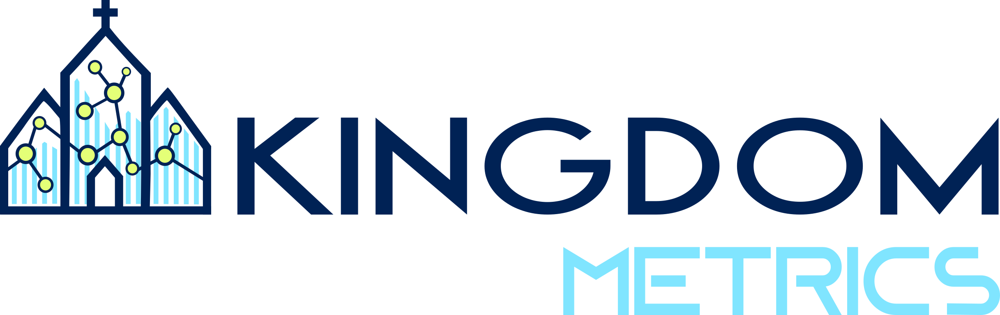

  

<h3 align="center">AI-Powered Church Attendance Tracking & Insights</h3>

  <a href="https://kingdommetrics.com">Website</a> · <a href="https://www.linkedin.com/company/kingdom-metrics/">LinkedIn</a> · <a href="https://www.instagram.com/kingdommetrics/">Instagram</a>

---

### What We Do

**Kingdom Metrics** eliminates manual headcounts by using high-resolution cameras and AI to automatically capture church service attendance. Churches receive accurate, automated reports — no volunteers, no spreadsheets, just reliable data delivered to their inbox after every service.

### How It Works

1. **Capture** — A camera takes a photo of the congregation during service.
2. **Count** — Our AI processes the image and produces attendance numbers with 95%+ accuracy.
3. **Report** — Automated emails deliver weekly counts, 4-week rolling trend graphs, and confidence scores directly to church leadership.

### Why It Matters

- **Data-driven decisions** — Spot attendance trends early to optimize service times, seating, and staffing.
- **Zero volunteer burden** — Fully automated capture means staff can focus on ministry, not counting.
- **Scalable** — Works for small churches and mega congregations alike.
- **Integrates with your ChMS** — Syncs attendance data with Church Metrics, MinistryPlatform, Planning Center, and more.

### Built With

Python · FastAPI · React · TypeScript · Docker · Computer Vision (Roboflow)

---

  North Palm Beach, FL · <a href="mailto:kingdommetrics@kingdommetrics.com">kingdommetrics@kingdommetrics.com</a> · (561) 770-8282

